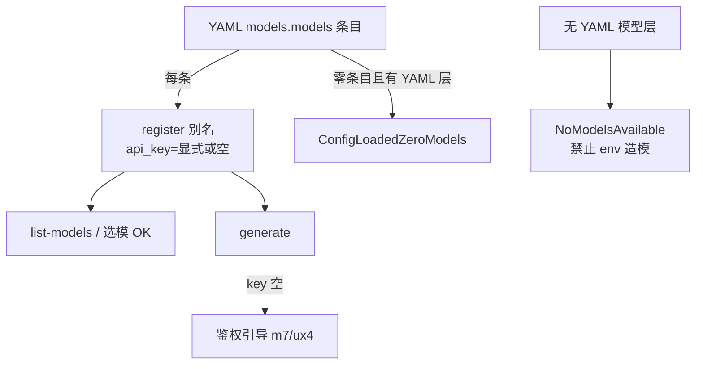

# Design：显式模型配置鉴权

## 决策

| 题 | 选择 |
|---|---|
| 注册门槛 | YAML 别名存在即 register；与 key 是否可解析无关 |
| `api_key` 省略 | 空串；**禁止** kind 级 env 回落 |
| `api_key: ""` | 同省略（已有：不回落） |
| `api_key: "{{ secret.X }}"` | 渲染后非空则用；渲染后空=空串 |
| 无 YAML 模型 | **删除** env→default_model_id 注入分支；空 registry → `NoModelsAvailable` / `ConfigLoadedZeroModels`（有 YAML 层但零条目） |
| Fake provider | 测试用 Fake 可继续空 key（既有） |

## 行为

## 非目标

- `/login` OAuth 产品化
- 自动从 models.dev 填 key
- 改变 `compat`/`api` 解析
