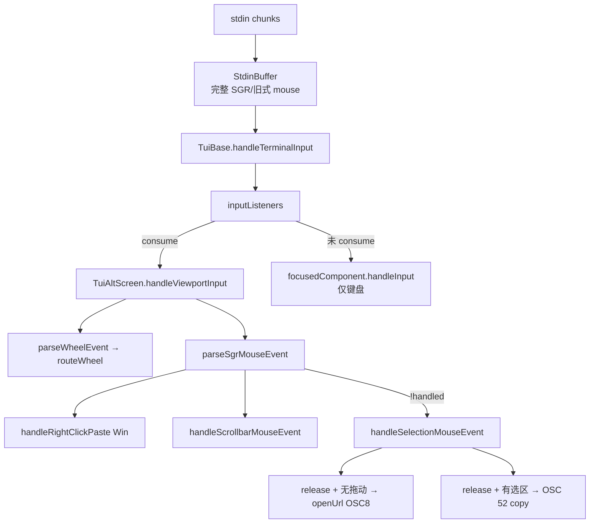

# Research: pi 折叠 UI / 鼠标命中 / 事件路径（一手源码）

> Change: `c2040-add-tui-mouse-click-fold-triangle`
> 仓库：`/home/l8ng/Projects/__straydragon__/pi`（pi-tui + coding-agent）
> 范围：终端 TUI 为主；HTML export 仅作对照面。禁止二手博客。

## 总判（可证实）

| # | 命题 | 结论 |
|---|---|---|
| 1 | TUI 有可折叠块 | **是**：tool / bash / compaction / skill / header 等；thinking 是全局 hide/show |
| 2 | TUI 有折叠三角可点 | **否**：无 `▶/▼` 折叠控件；提示是 keybinding 文案 |
| 3 | 鼠标可 toggle fold | **否**（TUI）；**是**（HTML export 整块 click） |
| 4 | 通用 Expandable 抽象 | **薄 duck-type**：`setExpanded(boolean)`；渲染按块特化 |
| 5 | 鼠标进组件树 | **否**：`Component` 无 mouse API；Alt-screen 引擎吞掉 SGR |

---

## 1. Expand-collapse 产品模型

### 1.1 全局开关，非定点块

`InteractiveMode` 持有：

| 状态 | 键（默认） | 行为 |
|---|---|---|
| `toolOutputExpanded` | `app.tools.expand` → `ctrl+o` | 遍历 header + chat/resources children，`setExpanded` 同步 |
| `hideThinkingBlock` | `app.thinking.toggle` → `ctrl+t` | 重建聊天；thinking → 静态 label 或完整 Markdown |

要点摘录：

```171:198:packages/coding-agent/src/modes/interactive/interactive-mode.ts
interface Expandable {
	setExpanded(expanded: boolean): void;
}
function isExpandable(obj: unknown): obj is Expandable { /* duck-type */ }
class ExpandableText extends Text implements Expandable { /* swap text */ }
```

```4031:4068:packages/coding-agent/src/modes/interactive/interactive-mode.ts
toggleToolOutputExpansion() → setToolsExpanded(!…)
setToolsExpanded: walk isExpandable children
toggleThinkingBlockVisibility: hideThinkingBlock flip + rebuildChatFromMessages()
```

绑定：`packages/coding-agent/src/core/keybindings.ts`（`app.tools.expand` / `app.thinking.toggle`）；editor `onAction` 在 `interactive-mode.ts` ~2808–2809。

### 1.2 块类型怎么「折」

| 类型 | 符号 | 折叠语义 | UI 提示 |
|---|---|---|---|
| Tool | `ToolExecutionComponent.setExpanded` → `ToolRenderContext.expanded` | 各 tool `renderResult` 预览行数（read 10 / grep 15 / bash 5 visual lines…） | `keyHint("app.tools.expand", "to expand")` |
| Bash UI | `BashExecutionComponent` | 尾部 `PREVIEW_LINES` vs 全量 | 同上 |
| Compaction / Skill / Branch | 各自 `setExpanded` | 一行摘要 vs 全文 Markdown | `keyText("app.tools.expand")` |
| Header / startup | `ExpandableText` | 短 help vs 长 help | key hints |
| Thinking | `AssistantMessageComponent.setHideThinkingBlock` | **整类**隐藏内容，只留 `Thinking...` label | **无**三角；靠 `ctrl+t` |
| Diff | `renderDiff` | **不可折叠**；着色/词级 diff；是否截断跟 tool `expanded` | — |
| Session tree | `TreeSelector.foldedNodes` | 分支折叠（导航 overlay） | 字形 `⊞`/`⊟`（**键盘** `app.tree.foldOrUp` / `unfoldOrDown`） |

实现文件（绝对路径前缀 `/home/l8ng/Projects/__straydragon__/pi/`）：

- `packages/coding-agent/src/modes/interactive/components/tool-execution.ts` — `setExpanded` / `getRenderContext().expanded`
- `packages/coding-agent/src/modes/interactive/components/bash-execution.ts` — preview + keyHint
- `packages/coding-agent/src/modes/interactive/components/assistant-message.ts` — thinking hide/show
- `packages/coding-agent/src/modes/interactive/components/compaction-summary-message.ts` 等
- `packages/coding-agent/src/core/tools/{read,bash,grep,ls,find,write}.ts` — `options.expanded` 截断
- `packages/coding-agent/src/modes/interactive/components/diff.ts` — 纯渲染
- `packages/coding-agent/src/modes/interactive/components/tree-selector.ts` — `⊞`/`⊟` + keyboard fold

### 1.3 HTML export（对照面，非 TUI）

`packages/coding-agent/src/core/export-html/template.js`：整块 `onclick` + `if(window.getSelection().toString())return;` 防拖选误触；全局 `T`/`O` 与 header 按钮。文案「click to expand」，**仍无折叠三角控件**。CHANGELOG 提到选区触发误 toggle 的修复（#3332）——冲突策略在 **DOM 面**，不是 pi-tui。

---

## 2. 鼠标：协议 → 引擎 →（不到组件）

### 2.1 架构



### 2.2 命中模型（有什么 / 没有什么）

| 目标 | 建模 | 符号 |
|---|---|---|
| ScrollView under pointer | `LayoutFrame` 盒树 `clip`/`rect` 点测，按 depth 排序 | `getScrollViewsAt` (`layout.ts`) |
| Scrollbar thumb | 几何：右列 `column` + thumb y 区间 | `getScrollbarGeometry` / `getScrollbarTargetAt` |
| Text selection | 终端 `(x,y)` → `SelectionPoint{row,col,scrollView?,boundary?}`；三击粒度 | `ClickTarget`（**连点计数**，非 UI 控件） |
| OSC 8 link | 屏幕行字符串列扫描 | `getOsc8LinkAtColumn` (`utils.ts`) |
| Fold triangle / Expandable | **不存在** | — |
| 组件 hit-test 树 | **不存在**；`Component` 只有 `render` / `handleInput?` / `invalidate` | `tui.ts` |

`ClickTarget` 定义（连点，非可点控件）：

```92:99:packages/tui/src/tui-alt-screen.ts
interface ClickTarget {
	timestamp: number; count: number; row: number;
	scrollView?: ScrollView; wordStart: number; wordEnd: number;
}
```

鼠标启用：`ENABLE_*_MOUSE`（1000/1002/1003/1004/1006）；`handleViewportInput` 对任意 SGR mouse **`return { consume: true }`**，故 **永不落入 focused component**。

Main-screen（`tui-main-screen.ts`）：**无** mouse 启用/处理。

---

## 3. 与选区/拖选的冲突消解

TUI 优先级（`handleViewportInput`）：

1. FOCUS_OUT / FOCUS_IN → consume
2. Wheel → scroll under pointer → consume
3. SGR mouse：
   a. 右键粘贴（Win）→ swallow
   b. Scrollbar press/drag → swallow（并清 selection）
   c. 否则 selection：press 建锚点；motion 拖选；release 时若未拖动且 `pressedUrl` → 开链，否则 OSC52 复制
4. 其余未识别 mouse 序列 → consume（防漏到键盘路径）
5. Alt-screen 键盘滚动/搜索 bindings → consume
6. 未 consume → editor `handleInput`

**无**「fold 优先于 selection」分支——因为没有 fold click。

HTML 对照：`getSelection().toString()` 非空则跳过 toggle（选区优先于 click-expand）。

---

## 4. 键盘全局 vs 定点点击 — 产品分工

| 面 | 分工 |
|---|---|
| **TUI 聊天 transcript** | **仅全局键盘**：`ctrl+o` 全体 tool/摘要块；`ctrl+t` 全体 thinking。无定点、无三角。 |
| **TUI session tree** | **键盘定点**（当前选中节点）：fold/unfold；字形装饰 `⊞`/`⊟`，**不可点**。 |
| **TUI 鼠标** | 滚动 / 选区复制 / OSC8 / 滚动条；**不参与** expand。 |
| **HTML export** | 整块 click expand + 全局 T/O；选区非空则不 toggle。 |

文档印证：`packages/coding-agent/docs/keybindings.md` Fullscreen Viewport 段只述 wheel/click-link/drag-select；Display 段 `app.tools.expand` / Models 段 `app.thinking.toggle`。

---

## 5. 字形与测宽

### 5.1 Transcript 折叠：不用三角

提示走 `keyHint` / `keyText`（`keybinding-hints.ts`）：dim 键名 + muted 说明，例如 `ctrl+o to expand`。SelectList 选中前缀是 `→ `（`select-list.ts`），**不是** fold chevron。

### 5.2 Tree 折叠字形（唯一接近「折叠控件」的 TUI 字形）

`tree-selector.ts` ~721–734：

- 可折叠展开：`⊟`；已折：`⊞`；不可折：`─`
- 无 connector 的根节点折叠：accent `⊞ `

**不**使用 `▶▼▸▾`。仓库内 `▶`/`▼` 出现在 mermaid 箭头、示例游戏/overlay，与 fold 无关；`latex.ts` 的 `triangleright: "▷"` 是公式映射。

### 5.3 测宽管线

`packages/tui/src/utils.ts`：`Intl.Segmenter(grapheme)` + `eastAsianWidth`（`get-east-asian-width`）→ `graphemeWidth` / `visibleWidth`；布局与 selection 列对齐都依赖它。pi **未**为 fold 字形做特判或 ascii fallback；tree 假定 `⊞`/`⊟` 与 `─` 同宽嵌入 3 列 indent 网格。

---

## 6. 通用抽象 vs 特化

```
Expandable (duck-type, interactive-mode 私有)
  ├─ ExpandableText          — header 双文本
  ├─ ToolExecutionComponent  — 转交 ToolDefinition.render*
  ├─ BashExecutionComponent  — 自管 preview
  ├─ *Summary / Skill / Custom* — 各自 rebuild
  └─（thinking 不实现 Expandable；独立 hideThinkingBlock）
```

扩展 API：`ToolRenderContext.expanded`、`registerEntryRenderer(..., { expanded }, …)`（`extensions/types.ts` / docs）。**无** HitRegion / FoldWidget / onClick 契约。

---

## xylitol：可借鉴 / 不可照搬

| 可借鉴 | 不可照搬 |
|---|---|
| 全局键盘折叠仍保留为「批量」语义（pi 的 `ctrl+o`/`ctrl+t`） | 假定 pi-tui 已有三角 click——**没有** |
| 鼠标流水线 swallow：引擎层 consume，避免脏进 editor | 直接抄 HTML 的整块 onclick（终端选区模型不同） |
| 选区 vs 激活：release 时「未拖动才当 click」（OSC8 模式）→ xylitol fold 可同构 | 把 `ClickTarget` 当控件 hit 表（它只服务三连点选词/行） |
| Layout 点测 ScrollView（盒树 depth）作滚动命中参考 | 期望 `Component.handleInput` 收 mouse——协议上不会到 |
| Duck-type / trait「可折叠」+ 渲染特化 | Tree 的 `⊞`/`⊟` 网格作为 transcript fold 字形（产品已拍 `▶`/`▼`） |
| HTML 的「有选区则不 toggle」作冲突启发式 | 把 export-html 行为当成 TUI 真源 |

**边界一句话**：pi 是「**键盘全局 expand + Alt-screen 鼠标专管滚动/选区/链接**」；xylitol c2040 要做的「点击折叠三角」是 **pi TUI 未实现的新产品缝**——可借事件优先级与选区消解模式，不能借控件/hit 表实现。

---

## 开放不确定点

1. Ambiguous-width 环境下 `⊞`/`⊟`/`▶` 在真实终端是否恒为 1 cell（pi 无专项测试/fallback）。
2. 未来 pi 是否计划给 transcript 加 click-fold（源码与 docs 均无 WIP 痕迹；仅 HTML 有 click）。
3. `toolOutputExpanded` 与 per-tool 独立态：当前强制全局同步，扩展能否局部覆盖未在 TUI 验证。
4. Main-screen 模式用户是否完全无 mouse（代码无 enable；产品是否依赖终端原生选区未在本调研展开）。
5. Overlay 打开时 selection 路径用 `hasOverlay()` 短路 ScrollView 命中——fold hit 若叠 overlay 需另设计（pi 无先例）。
