# Zellij 一手源码：鼠标协议 → 命中 → 选区冲突

> Change: `c2040-add-tui-mouse-click-fold-triangle`
> 源树：`/home/l8ng/Projects/__straydragon__/zellij`（Rust 终端 **多路复用器**，非 coding-agent TUI）
> 范围：只抽可迁移的**坐标空间 / 命中分层 / 手势 latch**；不套 zellij 的 pane/mux 产品语义。

---

## 边界（先证伪误用）

| Zellij 是 | 不是 / 勿硬套到 xylitol |
|---|---|
| client↔server mux；屏幕坐标命中 **pane 几何** | 应用面 scrollback fold 树组件 |
| 帧上 pin 复选框、叠窗标题行、插件行点击 | `▶/▼` 折叠三角 hit-test |
| 子进程 mouse tracking 开启时 **转发** VT 鼠标 | ApplicationOwned 内建选区与 fold 同屏 |

---

## 1. 端到端架构

```mermaid
flowchart LR
  HostTTY["Host TTY bytes / Win Console"]
  Stdin["zellij-client stdin_handler\nInputParser"]
  FromTw["input_handler::from_termwiz\n1-based → 0-based Position"]
  IPC["ClientToServerMsg::Action\nAction::MouseEvent"]
  Route["server route → ScreenInstruction::MouseEvent"]
  Screen["Screen::handle_mouse_event"]
  Tab["Tab::handle_mouse_event"]
  MH["MouseHandler\ngather → determine → execute"]
  Pane["Pane geom hit +\nframe intercept / select / forward"]

  HostTTY --> Stdin --> FromTw --> IPC --> Route --> Screen --> Tab --> MH --> Pane
```



**决策三件套（命中 SSOT）** — `zellij-server/src/tab/mouse_handler.rs`：

1. `MouseHandler::gather_mouse_event_context` → `MouseEventContext`（谁在点、是否在帧上、是否已在选区/resize/move）
2. `determine_mouse_action` → 私有枚举 `MouseAction`（优先级见 §4）
3. `execute_mouse_action` → 副作用（focus / selection / resize / `SendToTerminal` / plugin 事件）

入口：`Tab::handle_mouse_event` → 同上；`Screen::handle_mouse_event`（`screen.rs`）再消费 `MouseEffect`（分组、render、clipboard 提示）。

---

## 2. Mouse protocol：进 client → 到 server

### 2.1 开启序列（client → host）

`zellij-client/src/os_input_output.rs`：

- `ENABLE_MOUSE_SUPPORT` = `?1000h ?1002h ?1003h ?1015h ?1006h`
- `DISABLE_MOUSE_SUPPORT` 逆序关

Unix：`os_input_output_unix::enable_mouse_support` 写上述字节。Web client 同类串见 `web_client/utils.rs`。Windows：优先 VT；否则 crossterm `EnableMouseCapture`（`os_input_output_windows.rs`）。

含义（zellij 侧意图）：Normal + Button + Any motion tracking，并请求 SGR（1006）/ urxvt(1015)。

### 2.2 解码（client）

| 路径 | 模块 | 事实 |
|---|---|---|
| Unix / VT | `stdin_handler.rs` → vendored `termwiz::input::InputParser` | **显式只解析 SGR**：`parse_sgr_mouse`（`\x1b[<b;x;y M\|m`），`zellij-utils/src/vendored/termwiz/input.rs` |
| 归一化 | `input_handler::from_termwiz` | termwiz `MouseEvent` → `zellij_utils::input::mouse::MouseEvent`；`x/y` **减 1** 得 0-based `Position`；用 `mouse_old_event` 推 Press/Release/Motion（注释写明兼容 **pre-SGR X10 释放不带按钮**） |
| Windows Console | `stdin_handler_windows.rs` | `Event::Mouse` → `from_crossterm_mouse` → `InputInstruction::MouseEvent` |
| IPC | `Action::MouseEvent { event }` → `ClientToServerMsg::Action` → `route.rs` → `ScreenInstruction::MouseEvent` | 坐标已是 **屏幕 0-based cell** |

**证伪**：client 解析路径 **没有**独立的 X10 `\x1b[M...` / UTF-8 mouse（1005）解码器；只见 SGR `parse_sgr_mouse`。开启串含 `1015h`，但 vendored parser 不识别 urxvt 形态——依赖主机在 1006 下吐 SGR。

### 2.3 Server → 子终端（反向编码，非 host 解码）

`zellij-server/src/panes/grid.rs`：子进程 DECSET `1000/1002/1003` → `MouseTracking`；`1005` → `MouseMode::Utf8`；`1006` → `MouseMode::Sgr`。
`mouse_event_signal` / `mouse_left_click_signal`：在 tracking 开时把 **pane-相对** 坐标编回 X10/UTF8（`utf8_mouse_coordinates`）或 SGR，再 `write_to_active_terminal`。

共享类型：`zellij-utils/src/input/mouse.rs` — `MouseEvent { event_type, left/right/middle/wheel_*, shift/alt/ctrl, position }`；`MouseEventType::{Press,Release,Motion}`。

---

## 3. 坐标 → UI 区域（命中模型）

### 3.1 屏幕 → pane

`MouseHandler::get_pane_at` 顺序：

1. floating 可见 → `FloatingPanes::get_pane_id_at`
2. 否则 pinned floating → `get_pinned_pane_id_at`
3. 否则 tiled → `Tab::get_pane_id_at`

`PaneGeom::contains`（`zellij-utils/src/pane_size.rs`）：半开矩形 `[x,x+cols) × [y,y+rows)`。
叠窗（stacked）无 frames 时对 geom 做 y/rows 偏移（`get_pane_id_at` 内 `pane_contains_point`）——**几何校正，不是控件树**。

### 3.2 Pane → 内容相对坐标

`Pane::relative_position`（`tab/mod.rs`）= `Position::relative_to(content_y, content_x)`（`zellij-utils/src/position.rs`）。
`position_is_on_frame`：落在 content 外、geom 内的边框带。
转发子终端前：`event_for_pane.position = relative_position`（`execute_send_to_terminal` / click-through）。

### 3.3 「控件」级命中（仅有的几处）

| 交互 | 一手路径 | 命中规则 |
|---|---|---|
| Floating pin 复选框 | `Frame::clicked_on_pinned`（`ui/pane_boundaries_frame.rs`）；`TerminalPane`/`PluginPane::intercept_mouse_event_on_frame` | 相对坐标：`line == -1`（标题行）且 column ∈ pin 中心 ±1 |
| Frame 边 → resize / float move | `get_edge_at_position`（四分象限边）+ `determine_mouse_action` | `on_frame` 且非 intercept → `StartResize` / `StartMovingFloatingPane` |
| 插件高亮 Alt+Click | `pane.plugin_highlight_at` → `PluginInstruction::HighlightClicked` | 内容相对坐标上的高亮区间 |
| 插件 UI 点击 | `PluginPane::start_selection`：若 `!supports_mouse_selection` → `Event::Mouse(Mouse::LeftClick(line,col))` | **整 pane 内容坐标**交给插件；插件自建行映射 |

**证伪「内建 fold/tree 控件」**：core 无折叠三角 / tree widget hit API。接近「展开」的只有：

- **Stacked panes**：点到 stack 内某一 geom（常为单行标题）→ `FocusPane`（`focus_pane_at`），布局上露出该 pane——仍是 geom 命中。
- **插件侧列表**：如 `default-plugins/strider/src/state.rs::handle_left_click`：`line` → 列表索引（减 header 偏移）；同项再点 → `traverse_dir`。无独立 triangle 列。
- **session-manager** `result_expand`：键盘展开层次，非鼠标 fold hit。

插件事件契约：`zellij-utils/src/data.rs` `enum Mouse { LeftClick, Hold, Release, Hover, Scroll* }`。

---

## 4. 选区 / 拖选 vs 点击：冲突消解

`determine_mouse_action` **硬优先级**（先匹配先返回）：

```
resize latch  →  selection latch  →  float-move latch
  → Alt 分组/高亮
  → wheel（Ctrl=resize scroll）
  → Ctrl+Left on frame（intercept / resize）
  → plain Left Press:
        frame intercept → move/resize →
        active + terminal_wants_mouse → SendToTerminal
        active + !wants → StartSelection
        inactive → Focus / FocusAndClickThrough / pinned show
  → right/middle → 仅 active 时 SendToTerminal
  → left motion/release（无 latch）→ 仅 wants_mouse 时转发
  → buttonless motion → hover / focus-follows-mouse
```

**关键消解规则（可证实）**：

1. **手势 latch**：`tab.selecting_with_mouse_in_pane` / `pane_being_resized_with_mouse` / float move 为真时，后续 Motion/Release **只服务该手势**，不重算控件命中。
2. **Frame intercept 先于选区**：`frame_intercepted` → `FrameIntercepted`（pin toggle），不进 `StartSelection`。
3. **子终端 mouse tracking 吞掉 mux 选区**：`TerminalPane::terminal_emulator_wants_mouse` ⇔ `grid.mouse_tracking != Off`；active pane 且 wants → `SendToTerminal`，否则 `StartSelection`（`gather_clicked_pane_details` 用 `mouse_left_click(..., false).is_some()` 探测）。
4. **插件二选一**：`supports_mouse_selection`（默认 false；`SetSelfMouseSelectionSupport`）为真走 grid 选区，为假把 Left/Hold/Release 当 UI 事件——**选区与点击控件互斥**，由插件声明，非按像素抢。
5. **修饰键分流**：Alt+Left = group/highlight，不进普通选区；Ctrl+Left on frame = resize。

选区实现：`panes/selection.rs` `Selection`；terminal/plugin grid `start_selection` / `update_selection` / `end_selection`；release 可 clipboard（`copy_on_select`）。

---

## 5. 对 xylitol 最可迁移的模式

前置：xylitol 已是 **单进程 ApplicationOwned**（alt-screen + mouse capture），有 `TUI::set_transcript_hit_priority` → `SelectionController::hit_priority`（`packages/xylitol-tui/src/{tui,selection,application_owned_runtime}.rs`）：Left Down 回调 `true` → `clear` 选区且 **不启 drag**。勿引入 client/server 或 pane mux。

| 迁移 | 落点建议 | 勿迁 |
|---|---|---|
| **gather → determine → execute** 分层 | fold hit / dock / transcript 选区决策表化 | `MouseHandler` 整文件搬 |
| **控件 hit 优先于选区起笔** | 已有 `set_transcript_hit_priority`；对齐 zellij frame intercept | pane focus 语义 |
| **手势 latch** | 拖选中忽略 fold 重命中（zellij `selecting_with_mouse`）；现 AO 已偏 Pi「拖中不取消」 | resize/float move 状态机 |
| **双坐标空间** | screen `(col,row)` → content cell（已有 `screen_to_content`）；fold 表绑 render generation（见同目录 `fold-glyph-and-hittest.md`） | `Position::line==-1` 帧约定 |
| **区域排除** | dock `ScreenRect` 排除起笔 ≈ zellij「帧/非 content」 | floating z-order |
| **声明式互斥** | 「fold 命中区」与「选区」互斥（hit_priority）；勿等 release 再猜 | 子进程 mouse tracking 转发 |

**最小可抄决策序（应用面）**：

```
if selection_dragging: update/end only
else if LeftDown && hit_priority(col,row): swallow + clear
else if in_dock: dock path
else if in_transcript: start/update selection
```

---

## 6. 一手路径索引

| 主题 | 路径 |
|---|---|
| 共享鼠标类型 | `zellij-utils/src/input/mouse.rs` |
| Position / relative | `zellij-utils/src/position.rs` |
| Geom contains | `zellij-utils/src/pane_size.rs` (`PaneGeom::contains`) |
| SGR parse | `zellij-utils/src/vendored/termwiz/input.rs` (`parse_sgr_mouse`) |
| Enable mouse | `zellij-client/src/os_input_output.rs` (`ENABLE_MOUSE_SUPPORT`) |
| from_termwiz / dispatch | `zellij-client/src/input_handler.rs` |
| Stdin loop | `zellij-client/src/stdin_handler.rs` |
| Route | `zellij-server/src/route.rs` (`Action::MouseEvent`) |
| Screen | `zellij-server/src/screen.rs` (`handle_mouse_event`) |
| Hit / 决策 | `zellij-server/src/tab/mouse_handler.rs` |
| Pane trait 帧/相对 | `zellij-server/src/tab/mod.rs` |
| Pin 命中 | `zellij-server/src/ui/pane_boundaries_frame.rs` (`clicked_on_pinned`) |
| 子终端 encode | `zellij-server/src/panes/grid.rs` (`mouse_*_signal`, `MouseMode`) |
| Plugin 鼠标 | `zellij-server/src/panes/plugin_pane.rs`；`zellij-utils/src/data.rs` `Mouse` |
| 插件列表点击例 | `default-plugins/strider/src/state.rs` (`handle_left_click`) |
| xylitol 对照 | `packages/xylitol-tui/src/selection.rs`；`tui.rs` `set_transcript_hit_priority` |

---

## 7. 开放不确定点

1. 主机在仅 1015（无 1006）时，vendored `InputParser` 是否静默丢鼠标（无一手 fallback 解析）。
2. `from_termwiz` 的 X10 release 状态机与纯 SGR（`m` 带按钮）是否在所有主机上冗余或冲突。
3. Stacked 标题行点击是否总触发「展开」视觉——依赖布局 geom，无独立 toggle API，产品行为需 e2e 再钉。
4. `clicked_on_pinned` 注释承认 relative 坐标不准；边界格是否漏点未在本调研跑测。
5. 插件 `Hover`/`Hold` 与选区 latch 的时序边角（快速划过插件 pane）未逐测。
