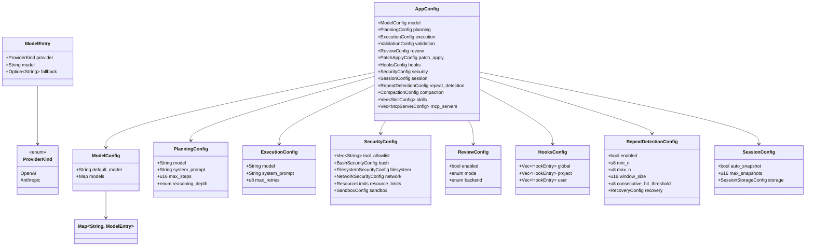
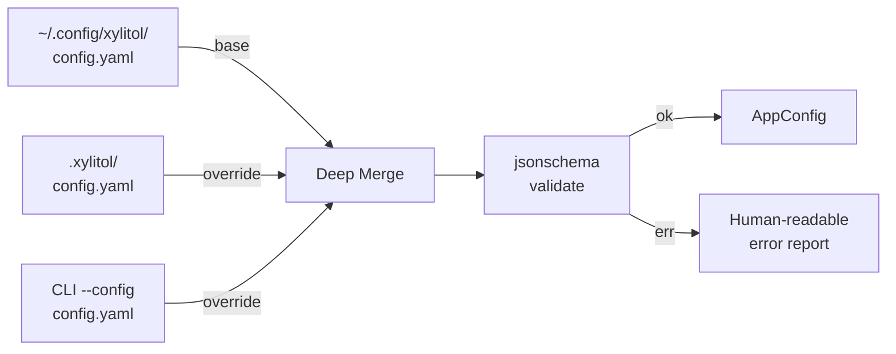
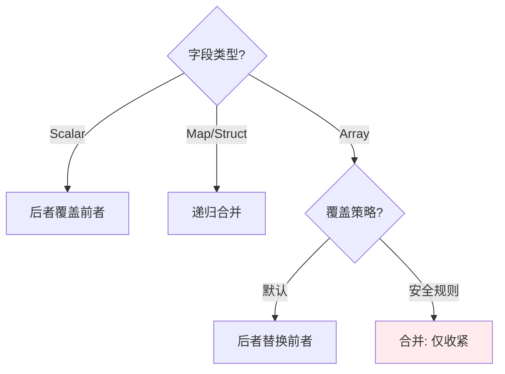
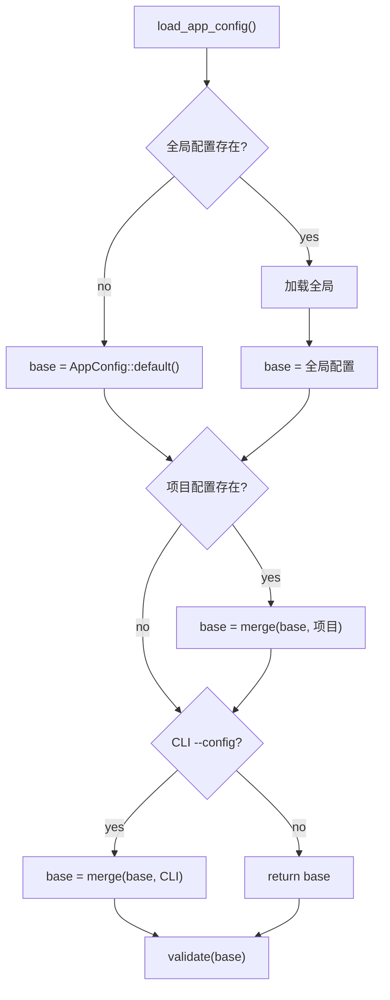
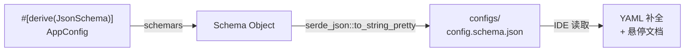

# c10-add-config — Design

## Context

- PRD: §2（核心架构配置驱动）、§5（规划器/执行器模型绑定）、§11.9（session 配置）、§12.2（安全配置结构）
- **adk-rust 集成**: AppConfig 作为 YAML 配置入口，通过构建器模式映射到 `adk-runner::RunnerConfig` 和 `adk-agent::LlmAgentBuilder`。无需自建运行时配置系统，adk-rust 已提供 `RunnerConfig`、`GenerateContentConfig` 等类型。
- **硬约束**: MVP 仅支持 OpenAI-compatible Response API 和 Anthropic-compatible API 两种 provider。ProviderKind 枚举仅含 `OpenAI | Anthropic`，不扩展。fallback 为可选单跳（OpenAI↔Anthropic），非多模型链。
- 依赖关系见 proposal.md frontmatter（depends_on / blocks 为 SSOT）

## Goals / Non-Goals

### Goals

- 定义完整 `AppConfig` 结构体，覆盖所有模块的配置需求
- 三级配置加载（全局 ~/.config/xylitol/ → 项目 .xylitol/ → CLI --config）
- 深层合并（后者覆盖前者，逐字段而非替换整个 section）
- JSON Schema 生成（`schemars`）供 IDE 补全
- 运行时校验（`jsonschema`）+ 人可读错误

### Non-Goals

- 不实现热重载（配置加载一次，运行时不变）
- 不实现配置迁移/版本升级逻辑
- 不处理加密字段（如 API key 存储由 adk-auth 负责）

## Decisions

### Decision 1: AppConfig 结构体设计

**背景**: 配置是所有模块的"神经系统"，需要在单一结构体中覆盖全部功能域，同时保持可扩展。

**选择**: 扁平化顶层 + 嵌套子结构。每个子结构对应一个功能域（由对应 change 实现）。`AppConfig` 包含一个 `runner` 字段直接映射 `adk-runner::RunnerConfig`，xylitol 特有字段（hooks、security、repeat_detection 等）作为扩展字段。

**权衡**: 扁平化比深层嵌套更容易做深层合并和 JSON Schema 生成。MVP 仅 `ProviderKind::OpenAI | ProviderKind::Anthropic` 两种变体。

### Decision 2: 三级配置加载与合并算法

**背景**: 用户可能在全局设默认，项目级覆盖，CLI 临时覆盖。合并必须正确处理嵌套结构。

**合并规则**:

安全规则合并的特殊逻辑（§12.3）：
- `allowed_patterns`: 后者与前者取**交集**（仅收紧）
- `forbidden_patterns`: 后者与前者取**并集**（仅收紧）
- `path_allowlist`: 取交集
- `path_blocklist`: 取并集

**选择**: serde_yaml 反序列化 → `serde_json::Value` 层面做深层合并 → 再反序列化为 `AppConfig`

**权衡**: 两步反序列化比直接 merge struct 更灵活（可以处理未知字段），但有少量运行时开销。

### Decision 3: 配置文件发现与缺失处理

**背景**: 三级配置中任何一级都可能不存在。

**选择**: 全部三级都是可选的。没有任何配置文件时使用 `AppConfig::default()`（内置默认值），确保无配置也能运行。

**权衡**: 零配置可运行（友好）vs 强制要求至少一个配置文件（安全）。选择友好——安全策略默认 deny-all 由 c50 处理，不依赖配置文件存在。

### Decision 4: JSON Schema 生成流程

**选择**: 编译时通过 `build.rs` 或手动脚本生成 schema 文件，而非运行时生成。

**权衡**: build.rs 增加编译时间但自动化；手动脚本灵活但容易忘记运行。先用手动脚本（`just gen-schema`），后期可改 build.rs。

## Risks / Trade-offs

### 技术风险

| 风险 | 等级 | 缓解 |
|------|------|------|
| `serde_yaml` 已 deprecated 但仍是 Rust 生态使用最广的 YAML crate | 中 | 监控社区收敛方向；内部封装 yaml 解析逻辑以便将来切换到 `saphyr` 或其他替代 |
| AppConfig 结构体随功能增长膨胀 | 中 | 子结构体各由对应 change 定义在自己的模块中，AppConfig 仅聚合引用 |
| ModelEntry.provider 约束过严 | 低 | 硬约束：MVP 仅 OpenAI-compatible + Anthropic-compatible 两种 API 模式，不扩展 ProviderKind |
| 安全规则合并逻辑复杂 | 低 | 独立函数 + 单元测试覆盖所有组合 |

### 集成风险

- 下游 change 新增配置字段时需修改 AppConfig——这是预期行为，每个 change 的 tasks 中已包含"注册配置"
- `serde_yaml` deprecated 可能影响用户信心——可在文档中说明当前选型理由

### 待确认问题

- 无
