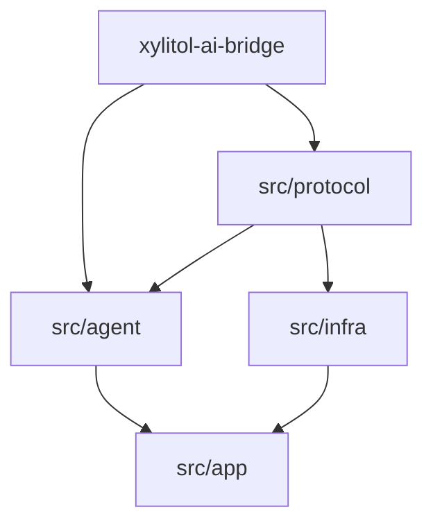

# Design: c1220 消 domain + protocol 收拢

## 目标依赖（单 crate）



箭头 = **Rust `use` 允许方向**（被指方依赖指方）：

- `agent` / `infra` **都依赖** `protocol`（vocab + ports + wire）。
- `agent` ↛ `infra`；`infra` ↛ `agent`（不变）。
- `protocol` **MUST NOT** 依赖 `agent` / `infra` 实现（可依赖 `xylitol_ai_bridge::dto`）。

### 为何不把 `AgentMessage` / `XyEvent` 物理放进 `agent/`

若词汇在 `agent/`，而 ports（`XyEventSink` / `XySessionStore`）与 wire 映射（`XyEvent::to_wire_event`）在 `protocol/`：

```text
agent → protocol（要用 XyModel 等 ports）
protocol → agent（要用 AgentMessage / XyEvent）
→ 模块环
```

pi 无此问题：`coding-agent` **可以**依赖 `pi-agent-core`。xylitol 坚持 `infra` ↛ `agent`，故共享词汇必须落在 **双方都能依赖、且不反过来依赖双方** 的层——即合并后的 `protocol/`（vocab 子树），**不是**复活 `domain/` 顶栏品牌。

## 语义拥有 vs 物理落点（已钉）

| 概念 | 语义拥有（谁写逻辑 / 谁再导出） | 物理模块（Rust 路径） |
|---|---|---|
| `AgentMessage` / `Env` / `AgentPart` | **agent**：组合规则、session 读写语义、`pub use` | `protocol/vocab/message.rs` |
| `project_for_llm` | **agent**（ReAct / compaction 调用点） | `agent/llm_project.rs`（或 `agent/message/project.rs`） |
| `SessionEntry` 等 JSONL vocab | **agent** session 语义；infra 只做 IO | `protocol/vocab/session.rs` |
| **`XyEvent`** | **agent** 循环/Driver **生产**；应用面消费 | **`protocol/vocab/lifecycle.rs`**（钉死，不放 `agent/`） |
| `XyEventSink` | port | `protocol/ports/event.rs` |
| wire `Event` / `Command` | 多客户端线协议 | `protocol/wire/` |
| `XyChunk` / `XyToolSchema` / thinking 级别 | port 签名 | `protocol/vocab/types.rs`（或拆文件） |
| `XyModel` 入参 | LLM DTO only | `Vec<AiBridgeMessage>`（bridge）；投影仅在 agent |

**`XyEvent` 钉死理由（对照 pi）**：对齐 `AgentEvent` 作为生命周期契约；xylitol 另有 wire `Event` 投影与 `XyEventSink`，二者都要在 `infra`/`protocol` 可见 → 物理归 **vocab**，不是 agent 私货。`protocol/wire/event.rs` 的 `Event` **≠** `XyEvent`；`to_wire_event` 留在 wire 旁（可 `impl` 在 vocab 或 wire 模块）。

## `protocol/` 目录（apply 强制）

三子树，**同顶栏、不同职责**——禁止混文件乱堆：

```text
src/protocol/
  mod.rs                 # 分层 re-export；可 flat pub use 常用符号
  wire/                  # client ↔ core 线协议（传输无关）
    command.rs
    event.rs             # wire Event（snake_case tag）
    transport.rs         # Envelope / ErrorCode
  ports/                 # agent ↔ infra 可替换契约（原 runtime_protocol）
    model.rs             # XyModel / XyStream / XyGenerateOptions（入参 AiBridgeMessage）
    tool.rs
    session.rs           # XySessionStore（签名用 vocab::SessionEntry）
    event.rs             # XyEventSink（签名用 vocab::XyEvent）
    bash.rs / export.rs / hook.rs / permission.rs / …
  vocab/                 # 原 domain 中进入 port/wire 签名的共享词汇（替代 domain 顶栏）
    message.rs           # AgentMessage / Env / …
    lifecycle.rs         # XyEvent（钉死）
    session.rs           # SessionEntry / SessionHeader / …
    types.rs             # XyChunk / XyToolSchema / Thinking*
    model_config.rs      # XyModelConfig / Kind（若仍被 port 引用）
    error.rs             # XyError / XyToolError
    resource.rs          # AgentsFile / SkillInfo / …（跟 XyResourceLoader）
```

**纪律**

- `wire/` MUST NOT 依赖 `ports/`（可依赖 `vocab/` 做投影）。
- `ports/` MAY 依赖 `vocab/` + bridge DTO；MUST NOT 依赖 `wire/`。
- `vocab/` MUST NOT 依赖 `ports/` / `wire/` / `agent` / `infra`；MAY 依赖 bridge DTO。
- 迁移期：`runtime_protocol/mod.rs` → `pub use crate::protocol::ports::*`；随后删顶栏。
- **禁止**再建 `src/domain/` 或第三纯类型顶栏；`vocab` 只是 `protocol/` 内分区名。

## 类型落点总表（今日 domain → 目标）

| 今日 `domain/` | 目标 |
|---|---|
| `message` | `protocol/vocab/message.rs`；`agent` `pub use` + 拥有投影 |
| `llm_project` | **`agent/`**（唯一投影实现） |
| `session_types` | `protocol/vocab/session.rs`；`agent/session` 编排 IO 经 port |
| `lifecycle`（`XyEvent`） | **`protocol/vocab/lifecycle.rs`**（钉死） |
| `types`（Chunk/ToolSchema/thinking） | `protocol/vocab/types.rs` |
| `model`（Kind/Config） | `protocol/vocab/model_config.rs`；registry 逻辑仍在 `agent/model` |
| `error` | `protocol/vocab/error.rs` |
| `resource_types` / `source_info` | `protocol/vocab/resource.rs` |
| `compaction_config` | `agent/compaction`（或 infra config，按唯一消费者） |
| `tool_result_quiet` / `text` | `agent/`（非 port 签名） |

## `XyModel` 边界

```text
今日: generate_stream(Vec<AgentMessage>, …)
目标: generate_stream(Vec<AiBridgeMessage>, …)  // 或类型别名 LlmMessage
```

投影 **MUST** 在 agent 完成；infra provider **MUST NOT** 再对 `AgentMessage` 做 Env 折叠主路径。

## 与 pi 对照（摘要）

| pi | xylitol c1220 |
|---|---|
| `pi-ai` 只吃 `Message[]` | `XyModel` 只吃 bridge DTO |
| `AgentMessage` + `AgentEvent` 在 agent-core；app 依赖 core | 同语义；因 `infra`↛`agent`，词汇物理在 `protocol/vocab`，agent 再导出并写投影 |
| 无统一 protocol 包 | `protocol/{wire,ports,vocab}` 收契约（产品多客户端需要 wire） |

## 风险

- 全仓 `crate::domain` / `crate::runtime_protocol` 替换面大 → 波次：`protocol` 三子树就位 → 改 `XyModel` → 迁 vocab → 删 `domain/` / `runtime_protocol/`。
- 调用点习惯：`crate::agent::XyEvent`（re-export）与 `crate::protocol::vocab::XyEvent` 同型；精选 `pub use` 仍以库契约为准。
- 勿把 `vocab` 写成第二 `domain`：新类型进 vocab 的门槛 = **是否出现在 port 或 wire 签名**；纯 agent 内部状态留在 `agent/`。
