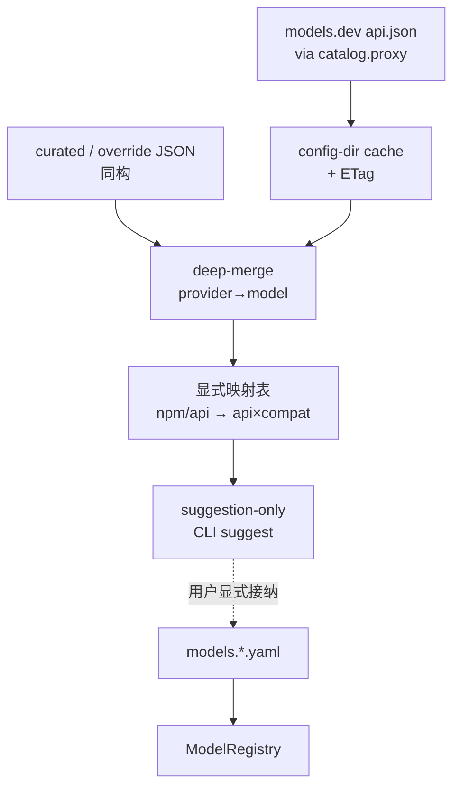

# Design：可选 models.dev catalog overlay

## 决策（正式化拍板）

| 开放题 | 选择 |
|---|---|
| 启用粒度 | 全局 `catalog.enabled`（默认 **false**）；pack 路径可配，不按 pack 单独总开关 |
| suggestion 出口 | **CLI MVP**：`catalog refresh` / `status` / `suggest`；TUI 后置 |
| curated pack | 用户配置目录优先；仓库可放 **示例** JSON（非运行时必装） |
| 多文件键空间 | 运行时合并以 **api.json 形状** 为主（provider → models）；`models.json` 作可选补强层；override deep-merge 同形 |
| thinking 原料 | `reasoning_options.effort.values` → 建议 `thinking_levels`（前加精确 `off`）；仅 `budget_tokens` → 不瞎编档名 |
| 依赖 | c1940（api×compat）；对齐 c1970/c1990 档位精确 opaque |

## 架构

## 行为细则

1. **默认 OFF**：`catalog.enabled=false` 或不存在 → 零拉取、零合并、启动与今日一致。
2. **proxy**：仅 `catalog.proxy`（或 env 等价）用于 catalog HTTP；MUST NOT 复用 LLM/transport proxy。
3. **refresh**：显式命令；失败保留旧 cache + 可理解错误；MUST NOT 污染 registry。
4. **suggestion-only**：合并+映射结果不得自动 `register`；CLI 列出可建议字段（含推荐 `api`/`compat`/`thinking_levels`）。
5. **映射失败**：未知 `npm` / 无法判定协议族 → 仍可 suggest 元数据，但标记「需手写 api×compat」。

## 测试边界（seam）

1. 配置解析：`catalog.enabled` 缺省 false；非法 proxy URL 加载失败或 refresh 失败（钉一种）。
2. 合并：override 覆盖 cache 同键。
3. 映射表：deepseek + `@ai-sdk/openai-compatible` 样例 → 建议 `compat=deepseek`（不自动注册）。
4. CLI：`catalog status/refresh/suggest` 早退，不经完整 agent bootstrap（对齐 tokenizer ops 精神）。
5. 证据：`research/source-toml-field-stats.json` + 有 proxy 后官方 `api.json` 交叉校验。

## 非目标

- TUI 模型列表内嵌 catalog 浏览（后置）
- pi 式编译期全表
- 自动注册 / 默认 ON
- 把 catalog JSON 当代码执行
