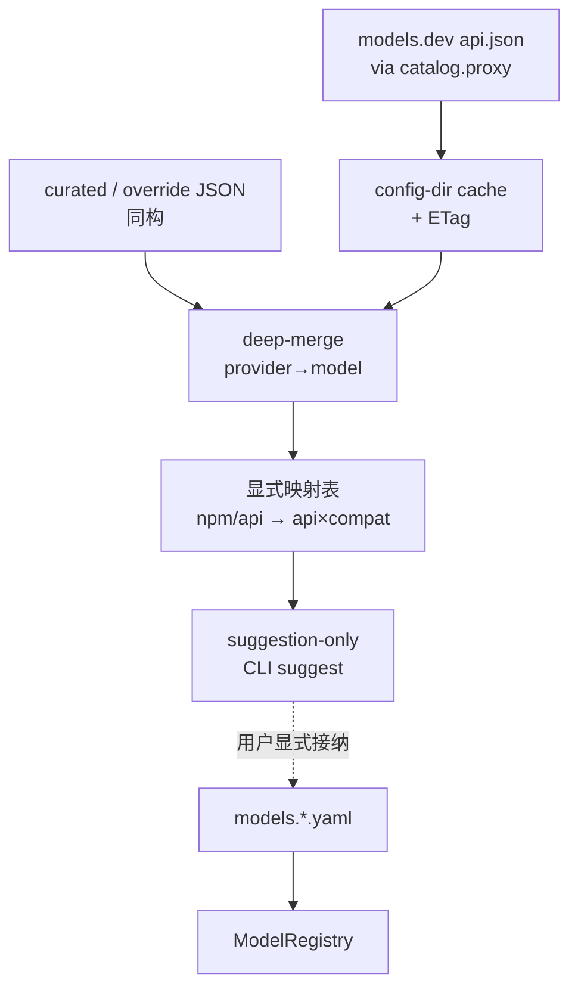

# Design：可选 models.dev catalog overlay

> **DELAYED**：与 proposal 同步 parked；下文为原拍板记录，**不实施**。

## 决策（正式化拍板 — 冻结）

| 开放题 | 选择 |
|---|---|
| 启用粒度 | 全局 `catalog.enabled`（默认 **false**）；pack 路径可配，不按 pack 单独总开关 |
| suggestion 出口 | **CLI MVP**：`catalog refresh` / `status` / `suggest`；TUI 后置 |
| curated pack | 用户配置目录优先；仓库可放 **示例** JSON（非运行时必装）；形状 MUST 与 **api.json** 同构 |
| **远程 refresh 目标** | **仅** `https://models.dev/api.json`（或文档化同源 URL）；**MUST NOT** 在 MVP 再拉 models.dev 的 `models.json` / `catalog.json` |
| 多文件键空间 | cache / override / pack 一律 **api.json 形状**（`provider_id → { …, models: { model_id → … } }`）；deep-merge 同形 |
| thinking 原料 | `reasoning_options[]` 中 `type=effort` 的 `values` → 建议 `thinking_levels`（前加精确 `off`）；`toggle`/`budget_tokens` → 不伪造成离散档超集 |
| 依赖 | c1940（api×compat）；对齐 c1970/c1990 档位精确 opaque |

## 对照 pi（为何不是「去掉补强」而是「从未依赖」）

pi **不**在运行时/生成脚本里消费 models.dev 的 `models.json` / `catalog.json`：

| 名字 | 实际是什么 | pi 怎么用 |
|---|---|---|
| models.dev `api.json` | provider→nested models 全表 | **`generate-models.ts` 唯一 fetch**：`fetch("https://models.dev/api.json")` → 编译期 catalog |
| models.dev `models.json` / `catalog.json` | 站点精选子集（实测 ~301） | **未引用** |
| `~/.pi/agent/models.json` | **用户**自定义 provider/模型配置 | runtime 覆盖层（与 models.dev 端点**同名异物**） |
| pi 发布的 `models/v1/models.json` + shards | 从 api.json **生成**后的 pi 自有 catalog | R2 发布；形状是 pi Model，不是 models.dev 原文 |

因此 c1980 钉「refresh 只拉 api.json」是 **对齐 pi 的 models.dev 数据源**，不是砍掉 pi 依赖的第二路。xylitol 的用户 override/pack 对应的是 pi 用户 `models.json` 那一层语义（本地同构覆盖），文件名可自定，**形状跟 api.json**，勿与 models.dev 精选 `models.json` 混谈。

## 架构

## 行为细则

1. **默认 OFF**：`catalog.enabled=false` 或不存在 → 零拉取、零合并、启动与今日一致。
2. **proxy**：仅 `catalog.proxy`（或 env 等价）用于 catalog HTTP；MUST NOT 复用 LLM/transport proxy。
3. **refresh**：显式命令；**只写** api.json 缓存（ETag）；失败保留旧 cache + 可理解错误；MUST NOT 污染 registry；MUST NOT 为「补全」再请求 models/catalog 端点。
4. **suggestion-only**：合并+映射结果不得自动 `register`；CLI 列出可建议字段（含推荐 `api`/`compat`/`thinking_levels`）。
5. **映射失败**：未知 `npm` / 无法判定协议族 → 仍可 suggest 元数据，但标记「需手写 api×compat」。
6. **后置（非 MVP）**：精选榜 / pi 式「生成后再发布」自有 catalog → 草案 **c2000-add-models-dev-codegen-catalog**（不混进本 change 的 models.dev refresh 管道）。
7. **命名陷阱**：文档与 CLI 文案 MUST 区分 models.dev `api.json`、用户 override JSON、以及（若有）未来自有 pack；避免把 pi 的 `~/.pi/agent/models.json` 说成 models.dev 端点。

## 测试边界（seam）

1. 配置解析：`catalog.enabled` 缺省 false；非法 proxy URL 加载失败或 refresh 失败（钉一种）。
2. 合并：override 覆盖 cache 同键。
3. 映射表：deepseek + `@ai-sdk/openai-compatible` 样例 → 建议 `compat=deepseek`（不自动注册）。
4. CLI：`catalog status/refresh/suggest` 早退，不经完整 agent bootstrap（对齐 tokenizer ops 精神）。
5. 证据：`research/source-toml-field-stats.json` + `research/api-json-official-cross-check.md`（官方三端点交叉校验已完成）。

## 非目标

- TUI 模型列表内嵌 catalog 浏览（后置）
- pi 式编译期全表
- 自动注册 / 默认 ON
- 把 catalog JSON 当代码执行
- MVP `catalog refresh` 拉取 `models.json` / `catalog.json` / `providers.json`（后两者无全表价值或非 JSON）
