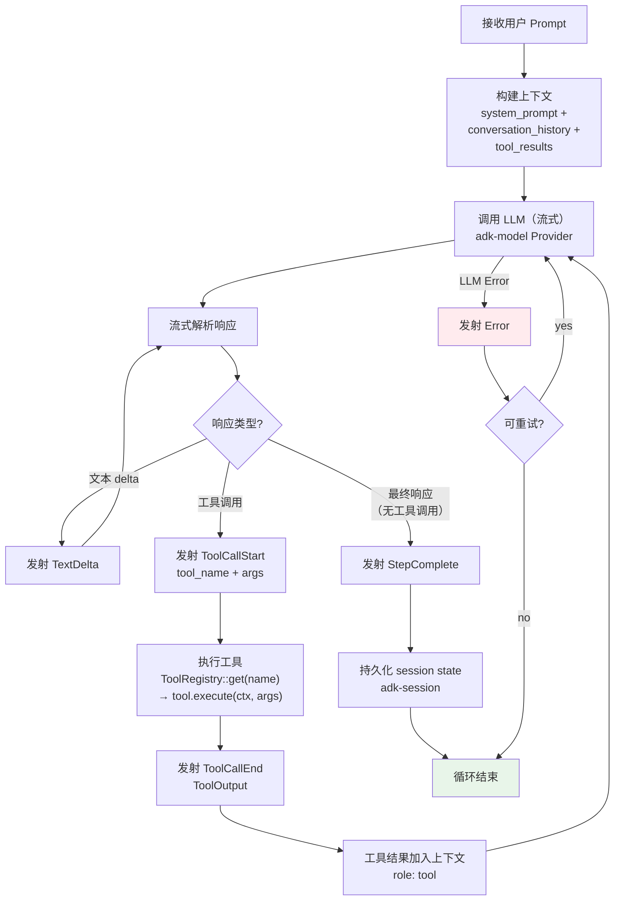
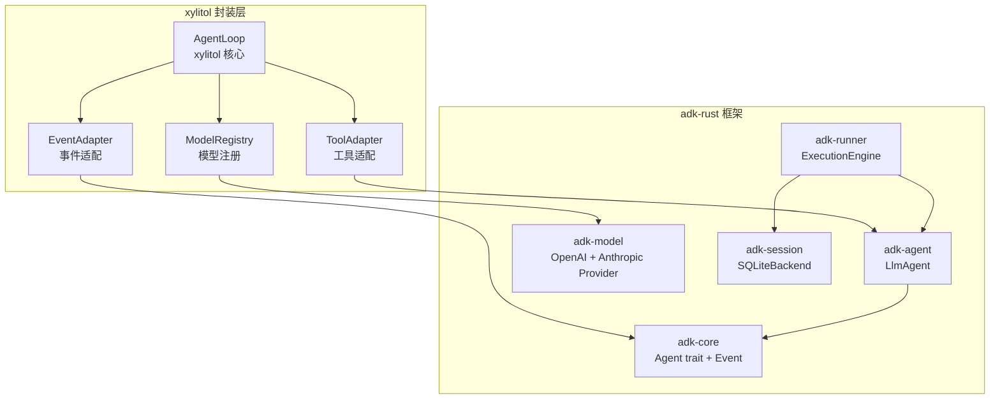
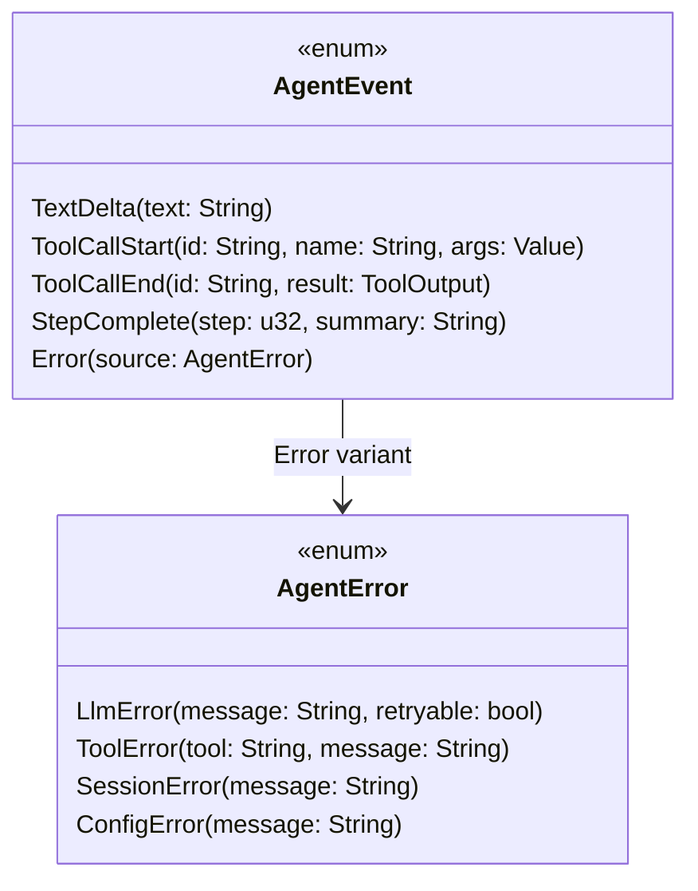
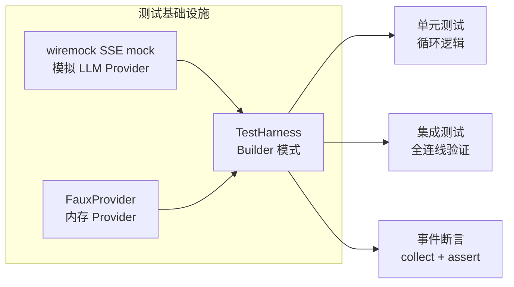

# c25-add-agent-loop — Design

## Context

- PRD: §2（核心架构 Agent 调度器）、§0.8.1（adk-rust v0.8 子 crate）、§0.3（adk-core/adk-agent/adk-runner 直接等效 pi-agent-core）
- 依赖关系见 proposal.md frontmatter（depends_on / blocks 为 SSOT）

## Goals / Non-Goals

### Goals

- 实现 agent 执行循环（prompt → LLM 流式 → 解析 → 工具分派 → 循环）
- 集成 adk-model LLM Provider（仅 OpenAI-compatible Response API + Anthropic-compatible 两种模式，流式 SSE 响应）
- 定义 AgentEvent 枚举 + 事件流发射
- 工具调用分派（集成 ToolRegistry）
- Session runtime（adk-session SQLite 后端）
- 上下文构建（对话历史 + 系统提示词 + 工具结果）

### Non-Goals

- 不实现规划-执行分离（c55 负责）
- 不实现上下文压缩/compaction（c70 快照系统的子功能）
- 不实现重复检测中断（c35 负责）
- 不实现模型抢占锁（c60 负责）
- 不实现 hooks 拦截（c40 负责，本 change 仅预留事件触发点）

## Decisions

### Decision 1: Agent Loop 核心流程



**选择**: 经典 ReAct 循环——LLM 输出文本或工具调用，工具结果反馈回 LLM，直到 LLM 不再请求工具。

**关键设计**: 使用 adk-agent 的 `LlmAgent` 作为基础构建块，而非从零实现循环逻辑。adk-agent 已处理流式解析、工具调用提取、多轮对话拼接等细节。

### Decision 2: adk-rust 集成架构



**选择**: 使用 adk-rust 作为运行时框架（LlmAgent + Runner + Session），xylitol 提供三层适配：
1. `ToolAdapter` — xylitol Tool trait → adk FunctionTool
2. `EventAdapter` — adk Event → xylitol AgentEvent
3. `ModelRegistry` — 配置驱动创建 adk-model Provider 实例（仅 OpenAI-compatible + Anthropic-compatible）

**权衡**: 使用 adk-rust 减少自己维护的循环代码量，但引入了对 adk-rust API 的依赖。adk-rust v0.8 尚未 1.0，API 可能变化。

### Decision 3: AgentEvent 枚举设计



**选择**: 5 种事件类型覆盖循环生命周期。事件通过 `tokio::sync::broadcast` 通道发射，所有消费者（Print mode、TUI、RPC）订阅同一通道。

**事件流示例**:
```
TextDelta("I'll read")
TextDelta(" the file")
ToolCallStart("tc1", "read", {file: "main.rs"})
ToolCallEnd("tc1", ToolOutput { output: "...", success: true })
TextDelta("Now I'll edit...")
ToolCallStart("tc2", "edit", {...})
ToolCallEnd("tc2", ToolOutput { output: "...", success: true })
StepComplete(1, "Fixed the bug")
```

### Decision 4: Session 集成策略

```mermaid
sequenceDiagram
    participant User
    participant Loop as AgentLoop
    participant Runner as adk-runner
    participant Session as adk-session<br/>(SQLite)

    User->>Loop: run(prompt)
    Loop->>Runner: create InvocationContext
    Runner->>Session: load_or_create(session_id)

    loop 每轮 LLM 调用
        Loop->>Runner: invoke(agent, ctx)
        Runner->>Session: save_turn(state)
    end

    Runner->>Session: save_final(state)
    Runner-->>Loop: events + final result
    Loop-->>User: AgentEvent stream
```

**选择**: 使用 adk-session SQLite 后端持久化每轮对话状态。session_id 由 CLI 层生成（或从配置恢复）。

**权衡**: SQLite 比内存存储多一层 I/O，但支持断点恢复和快照派生（c70 依赖此能力）。

### Decision 5: 测试策略——wiremock + TestHarness



**选择**: `wiremock` mock SSE 响应 + `FauxProvider` 内存 Provider + `TestHarness` Builder。

**测试场景覆盖**:
- 纯文本响应（无工具调用）
- 文本 + 工具调用 + 最终响应
- 多轮工具调用
- LLM 错误 + 重试
- 工具执行错误

## Risks / Trade-offs

| 风险 | 等级 | 缓解 |
|------|------|------|
| adk-rust API 不稳定（v0.8 pre-release） | 高 | 适配层隔离变更；可降级为自建循环（回退成本中等） |
| adk-model provider 扩展 | 低 | 硬约束：仅启用 OpenAI + Anthropic 两个 provider，不扩展。ProviderKind 枚举锁定为 `OpenAI | Anthropic` |
| wiremock mock 与真实 LLM 行为差异 | 中 | 集成测试使用真实 API（CI secrets）；mock 仅用于单元/快速测试 |
| broadcast channel 消费者慢导致背压 | 低 | 事件通道使用 bounded buffer + 溢出丢弃策略（非阻塞） |

### 待确认问题

- adk-rust v1.0 发布时间线——如果推迟太久，是否需要降低耦合度？
