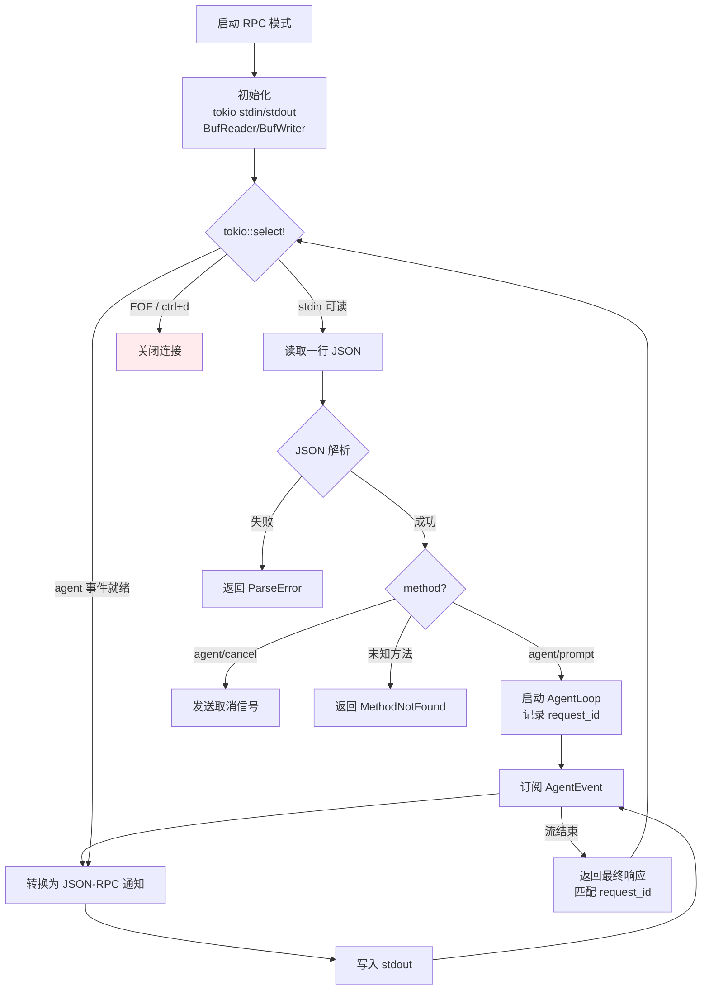
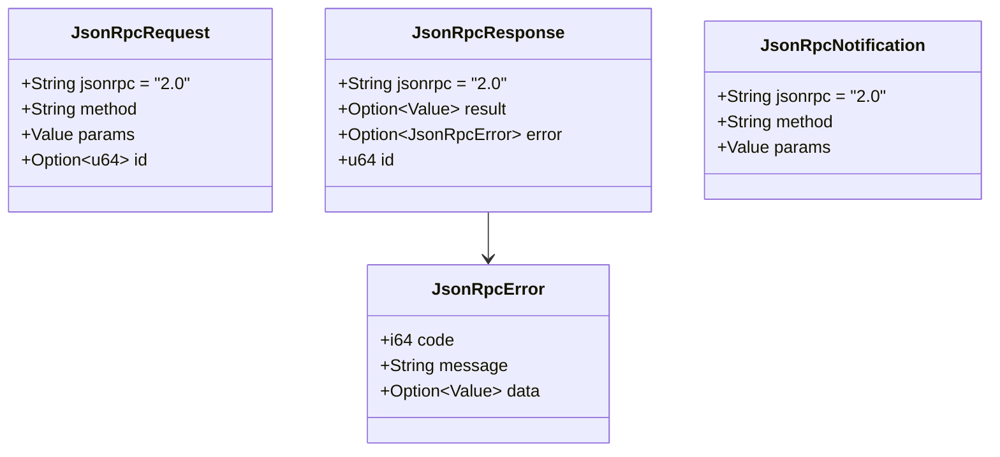

# c87-add-rpc-mode — Design

## Context

- PRD: §0.2（三种模式：Interactive/Print/JSON-RPC）、§0.2 参考架构（codex-rs JSON-RPC）
- 依赖关系见 proposal.md frontmatter（depends_on / blocks 为 SSOT）

## Goals / Non-Goals

### Goals

- 实现 JSON-RPC 2.0 over stdio 协议
- 请求/响应/通知结构体序列化
- 事件流 → JSON-RPC 通知转换
- IDE 集成友好（agent/prompt, agent/cancel 等方法）
- bidirectional stdio 读写循环

### Non-Goals

- 不实现 HTTP transport（仅 stdio）
- 不实现 WebSocket transport
- 不实现 JSON-RPC batch 请求（单条处理）
- 不实现 IDE 插件（仅提供协议层）

## Decisions

### Decision 1: JSON-RPC 协议设计

```mermaid
sequenceDiagram
    participant IDE as IDE / 外部工具
    participant RPC as RPC Server<br/>(stdio)
    participant Loop as AgentLoop

    IDE->>RPC: {"jsonrpc":"2.0","method":"agent/prompt","params":{"text":"fix bug"},"id":1}

    RPC->>Loop: run(prompt)
    Loop-->>RPC: TextDelta("I'll read...")
    RPC-->>IDE: {"jsonrpc":"2.0","method":"agent/text_delta","params":{"text":"I'll read..."}}

    Loop-->>RPC: ToolCallStart("read", ...)
    RPC-->>IDE: {"jsonrpc":"2.0","method":"agent/tool_call_start","params":{"tool":"read","args":{...}}}

    Loop-->>RPC: ToolCallEnd(...)
    RPC-->>IDE: {"jsonrpc":"2.0","method":"agent/tool_call_end","params":{"tool":"read","result":{...}}}

    Loop-->>RPC: StepComplete
    RPC-->>IDE: {"jsonrpc":"2.0","result":{"status":"done","steps":1},"id":1}

    Note over IDE,RPC: 取消场景

    IDE->>RPC: {"jsonrpc":"2.0","method":"agent/cancel","params":{}}
    RPC->>Loop: cancel()
    Loop-->>RPC: StepComplete (cancelled)
    RPC-->>IDE: {"jsonrpc":"2.0","result":{"status":"cancelled"},"id":2}
```

**选择**: 每个 AgentEvent 映射为一个 JSON-RPC 通知（无 id），最终结果映射为响应（有 id，匹配请求 id）。

**方法清单**:

| 方法 | 方向 | 说明 |
|------|------|------|
| `agent/prompt` | 请求→响应 | 启动 agent 执行，流式通知中返回过程 |
| `agent/cancel` | 请求→响应 | 中断当前执行 |
| `agent/text_delta` | 通知 | 文本增量输出 |
| `agent/tool_call_start` | 通知 | 工具调用开始 |
| `agent/tool_call_end` | 通知 | 工具调用完成 |
| `agent/step_complete` | 通知 | 步骤完成 |
| `agent/error` | 通知 | 错误事件 |

### Decision 2: stdio 读写循环



**选择**: `tokio::select!` 并发处理 stdin 输入和 agent 事件流。每个 JSON-RPC 消息一行（`\n` 分隔），使用 BufReader/BufWriter 优化 I/O。

**关键约束**: stdout 必须严格单写——stdin 读取和事件通知不能并发写 stdout（会导致 JSON 交错）。使用 `tokio::sync::Mutex<BufWriter>` 保护 stdout 写入。

### Decision 3: 消息结构体



**选择**: 三种消息类型（Request/Response/Notification），使用 serde_json 直接序列化/反序列化。不引入 jsonrpc-core 等框架（减少依赖）。

## Risks / Trade-offs

| 风险 | 等级 | 缓解 |
|------|------|------|
| stdout 写入交错导致 JSON 格式错误 | 高 | Mutex 保护写入；每条消息一行 + flush |
| IDE 集成时协议版本兼容 | 中 | 严格遵循 JSON-RPC 2.0 规范；方法版本化（v1/前缀） |
| stdio 缓冲区溢出 | 低 | BufReader 限制最大行长度；超大请求返回错误 |

### 待确认问题

- 无
